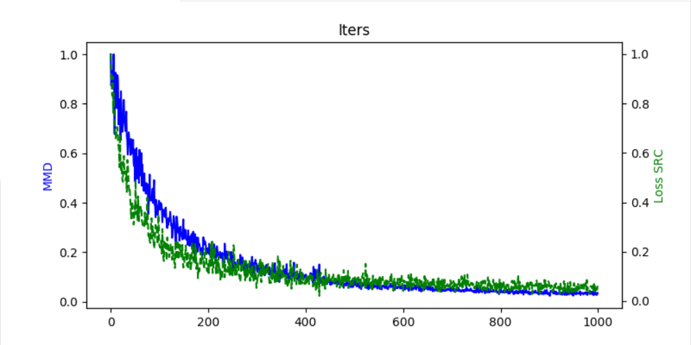

# AutoAdapter
## INTRODUCTION
An nn-based model for domain adaptation, which works by minimizing
the training loss of source domain and mmd distance between
source and target at the same time.
The relationship between autoAdapter and TCA is similaer to the relationship
between autoEncoder and PCA.
## HOW TO USE
```python
aa = autoAdapter()
aa.fit(src_data, tgt_data)
new_feats = aa.transform(feats)
src_data, tgt_data is an instance of class contains dataset member.
```
## VISULIZATION

## REFERENCE
[1] *Ghifary M, Kleijn W B, Zhang M. Domain Adaptive Neural Networks for Object Recognition[J]. 2014, 8862:898-904.*
## CONCAT
pyk3350266@163.com
