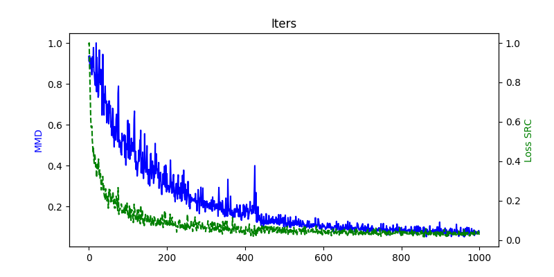

# AutoAdapter
## INTRODUCTION
AutoAdapter is an nn-based model for domain adaptation, which works by minimizing
the training loss of source domain and mmd distance between
source and target at the same time.
The relationship between autoAdapter and TCA is similar to the relationship
between autoEncoder and PCA.
[code of BDA(TCA, JDA)](/yourdady/DomainAdaptation/).
## HOW TO USE
```python
aa = autoAdapter(input_dim, new_dim, n_classes, model_path = None, lamb = 0.01, learning_rate = 0.01
                 , batch_size_src = 128, batch_size_tar = 128, training_steps = 5000, l2 = 0.001,
                 optimizer = 'GD', save_step = 20, print_step = 20, kernel_type = 'linear', sigma_list=None,
                 ** kernel_param)
aa.fit(data_src, data_tar, onehot, plot)
new_feats = aa.transform(feats)
#data_src, data_tar are instances of class which contains a dataset member.
```
## VISUALIZATION

## REFERENCE
[1] *Ghifary M, Kleijn W B, Zhang M. Domain Adaptive Neural Networks for Object Recognition[J]. 2014, 8862:898-904.*
## CONCAT
pyk3350266@163.com
